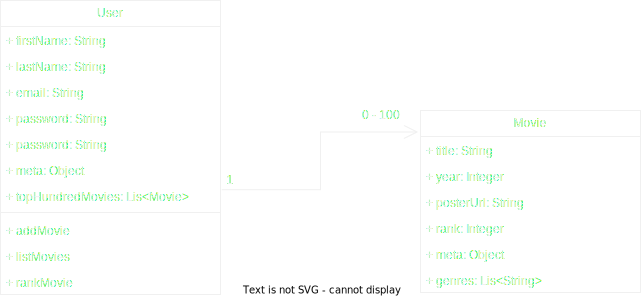

# My Top One Hundred Movies



The best approach for representing the top 100 movies for a user would be to embed the movie information within the user document in MongoDB.

Embedding the movie information within the user document allows for faster queries and simpler transactions since all of the relevant data is stored in a single document. This would be particularly advantageous for a use case like MyTop100Movies, where the top 100 movies are always going to be accessed in the context of the user who ranked them.

If the movie information was stored in a separate collection, querying the top 100 movies for a user would require a separate query to the movies collection, which could slow down the performance of the application.

In addition, embedding the movie information would make it easier to enforce data consistency and transactional integrity, as the entire user document could be updated atomically.

Database: movies

Collections:

- [x] users
- [x] movies

Users Collection:
Each document in the users collection represents a user and contains the following fields:
- [x] _id: unique identifier for the user (MongoDB will generate an ObjectID)
- [x] name: the user's name
- [x] email: the user's email address
- [x] password: the user's password (hashed for security)
- [x] topHundred: an array of objects representing the user's top 100 movies. Each object in the array has the following fields:
- [x] movieId: the ID of the movie in the movies collection
- [x] rank: the user's ranking of the movie (1-100)

# How to Run The Project

First, run the following command to compile the project

```
npm install
```

Then run

```
mvn start
```

# How to run the tests

Clone the repository and run the command
 ```
 npm run jest
 ```
this will first clean the project by running

The base url for accessing the live application is: http://18.170.0.36:7070/
The postman documentation is: https://www.postman.com/interstellar-space-182481/workspace/favorite-movies/collection/5870422-e9f25119-30d3-4979-9bd5-5a3aa8d94b0b?action=share&creator=5870422